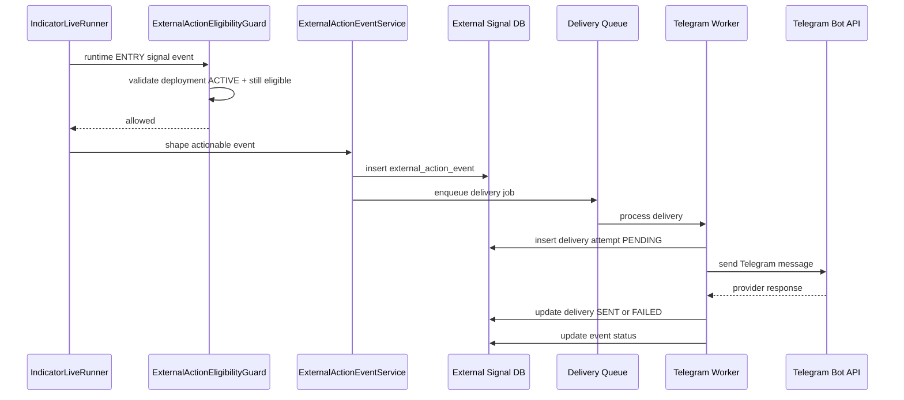

# External Action Signal Architecture

## Purpose

This note turns Story `6.6-publish-actionable-live-signal-events-to-external-subscribers` into an implementation-oriented technical baseline.

It defines:

- the v1 bounded context,
- the dedicated external signal-event database,
- the canonical actionable payload,
- the Telegram delivery flow,
- and the eligibility-driven auto-pause behavior.

This note is intentionally short. It is meant to remove ambiguity before implementation starts, not replace the story.

## V1 Scope

### In Scope

- publish externally actionable live `ENTRY` events only
- activate external publishing through `ExternalDeployment`
- persist actionable events in a dedicated physical Postgres database
- persist replay metadata and Telegram delivery history in that same database
- deliver to exactly one Telegram bot / audience configuration per external deployment
- auto-pause the external deployment immediately when eligibility is lost

### Out of Scope

- direct MT5 execution for Telegram subscribers
- subscriber-specific private routing
- multiple Telegram audiences per deployment in v1
- SL/TP outbound event publishing in v1
- Discord, copy-trading bridges, or other channels

## Bounded Context

This feature is a new bounded context adjacent to, but separate from:

- internal live runtime evaluation
- paper auto-execution
- trading command execution
- existing webhook delivery

The separation rule is:

1. `IndicatorLiveRunner` continues to own signal evaluation.
2. The new external-action lane shapes a canonical actionable event from the internal runtime event.
3. That canonical event is persisted in the dedicated external database.
4. Telegram delivery reads only from the persisted external event record.

The runtime tick must never depend on Telegram success.

## Activation Model

### Core Decision

External publishing is activated through `ExternalDeployment`, not directly on `SignalDefinition` and not directly on raw `IndicatorInstance`.

### Why

- runtime events come from live deployments, not from static definitions
- we need a deployment-scoped status lifecycle
- Telegram audience config belongs to a publishable deployment
- future channels can attach to the same deployment object cleanly

### Proposed Relationship

```text
SignalDefinition
  -> BacktestRun
  -> IndicatorInstance
  -> ExternalDeployment
  -> ExternalActionEvent
  -> ExternalActionDelivery
```

### Canonical vs Snapshot Rule

`ExternalDeployment` must distinguish between:

- **canonical linkage fields**
  - `indicator_instance_id`
- **denormalized snapshot fields**
  - `signal_code`
  - `signal_version`
  - `source_backtest_run_id`

Rules:

1. `indicator_instance_id` is the canonical upstream reference.
2. snapshot fields are copied at deployment creation time for queryability, audit, and operational resilience.
3. snapshot fields are not treated as the synchronization source of truth for the main application database.
4. if later metadata drift occurs between main DB and external DB, runtime linkage still resolves through `indicator_instance_id`.

## Dedicated Database

### Database Boundary

Use one new physical Postgres database for the external-action lane.

Suggested env names:

- `EXTERNAL_SIGNAL_DB_URL`
- `EXTERNAL_SIGNAL_DB_READ_URL` if read replica is added later

### Why Physical Separation

- isolates external delivery load from the main application database
- simplifies retention and archival policy
- keeps replay and outbound delivery state out of internal trading tables
- lowers coupling between internal runtime records and subscriber-facing delivery

### Data Stored in the New Database

- external deployment metadata
- canonical actionable events
- delivery attempts and provider responses
- replay and retry metadata

The main application database remains the source of truth for:

- signal definitions
- backtests
- indicator instances
- internal `signal_events`
- trading commands and audit

## Proposed Data Model

### 1. `external_deployments`

Purpose:
- activation object for external publishing

Suggested fields:

```text
id
indicator_instance_id
signal_code
signal_version
source_backtest_run_id
status                      -- DRAFT | ACTIVE | PAUSED | ARCHIVED | AUTO_PAUSED
status_reason
eligibility_state_snapshot
telegram_bot_id
telegram_chat_id
telegram_chat_label
created_by_user_id
enabled_by_user_id
enabled_at
paused_at
archived_at
last_eligibility_check_at
created_at
updated_at
```

Notes:
- `indicator_instance_id` references the main application DB record logically, not necessarily by cross-db foreign key
- use application-level validation because cross-database FK is usually not available
- `signal_code`, `signal_version`, and `source_backtest_run_id` should be treated as denormalized snapshot fields, not canonical linkage

### 2. `external_action_events`

Purpose:
- canonical persisted actionable event

Suggested fields:

```text
id
external_deployment_id
internal_signal_event_id
idempotency_key
contract_kind              -- actionable-signal-event
contract_version           -- 1
event_type                 -- ENTRY
actionability              -- ACTIONABLE | CANCELED | EXPIRED | SUPERSEDED | ADVISORY
action_type                -- OPEN_MARKET
signal_code
signal_version
indicator_instance_id
source_backtest_run_id
symbol
timeframe
side
candle_time
reference_price
entry_price
entry_type
stop_loss
take_profit_1
take_profit_2
suggested_volume
payload_json
status                     -- PENDING | READY | SENT | FAILED | CANCELED
status_reason
emitted_at
expires_at
supersedes_event_id
created_at
updated_at
```

Uniqueness:

- unique `idempotency_key`
- recommended shape:
  - `externalDeploymentId:internalSignalEventId`

### 3. `external_action_deliveries`

Purpose:
- Telegram delivery attempt history

Suggested fields:

```text
id
external_action_event_id
external_deployment_id
channel_kind               -- TELEGRAM
attempt_number
status                     -- PENDING | SENT | FAILED
provider_message_id
provider_chat_id
request_json
response_json
error_code
error_message
attempted_at
delivered_at
created_at
```

### 4. `external_action_replay_jobs`

Purpose:
- explicit replay and resend tracking

Suggested fields:

```text
id
external_action_event_id
replay_kind                -- MANUAL_RETRY | AUTOMATIC_RETRY | BACKFILL_REPLAY
status                     -- QUEUED | PROCESSING | COMPLETED | FAILED
queued_at
started_at
finished_at
error_message
created_by_user_id
created_at
```

## Canonical Payload

### Rule

Persist a machine-readable canonical payload first.
Render the Telegram message from that payload.

Do not make Telegram formatting the system of record.

### V1 Contract

```json
{
  "contractKind": "actionable-signal-event",
  "contractVersion": 1,
  "eventId": "evt_123",
  "emittedAt": "2026-03-13T10:15:00.000Z",
  "actionability": "ACTIONABLE",
  "actionType": "OPEN_MARKET",
  "source": {
    "signalCode": "SONGTRAP",
    "signalVersion": 3,
    "indicatorInstanceId": "inst_123",
    "sourceBacktestRunId": "run_123",
    "externalDeploymentId": "extdep_123",
    "eligibilityState": "live-eligible"
  },
  "market": {
    "symbol": "BTCUSDc",
    "timeframe": "1h",
    "side": "LONG",
    "candleTime": "2026-03-13T10:00:00.000Z",
    "referencePrice": 84250.5
  },
  "execution": {
    "entryPrice": 84250.5,
    "entryType": "MARKET",
    "stopLoss": 83600.0,
    "takeProfit1": 85000.0,
    "takeProfit2": 85800.0,
    "suggestedVolume": null
  },
  "trace": {
    "internalSignalEventId": "sig_evt_123",
    "signalKey": "SONGTRAP@v3"
  }
}
```

### Required Fields

- `contractKind`
- `contractVersion`
- `eventId`
- `emittedAt`
- `actionability`
- `actionType`
- `source.signalCode`
- `source.signalVersion`
- `source.indicatorInstanceId`
- `source.externalDeploymentId`
- `market.symbol`
- `market.timeframe`
- `market.side`
- `market.candleTime`
- `market.referencePrice`
- `execution.entryPrice`
- `execution.stopLoss`
- `trace.internalSignalEventId`

### Optional in V1

- `execution.suggestedVolume`

Reason:
- downstream users can have different balances and risk settings

## Telegram Delivery Model

### V1 Decision

Exactly one Telegram bot / audience configuration per external deployment.

That means each `ExternalDeployment` resolves to one:

- bot token identity
- target chat or channel

### Suggested Message Flow

```text
IndicatorLiveRunner
  -> create internal signal_event
  -> external action service shapes canonical event
  -> write external_action_events row
  -> enqueue telegram delivery job
  -> telegram worker sends message
  -> write external_action_deliveries row
```

### Audience Configuration Rule

V1 locks each `ExternalDeployment` to exactly:

- one bot token reference
- one target chat/channel
- one default message rendering strategy

This avoids turning v1 into a channel-management product.

### Message Rendering Rule

Telegram message is a presentation layer.

Suggested sections:

- signal name / code / version
- symbol / timeframe / side
- entry / SL / TP1 / TP2
- emitted time
- deployment label
- disclaimer that this is a signal, not guaranteed execution

## Eligibility Auto-Pause

### Rule

If the deployment loses eligibility, auto-pause immediately.

### Owner and Trigger

V1 should use a two-layer model:

1. **inline publish guard**
   - owner: `ExternalActionEligibilityGuard`
   - responsibility: block any publish attempt if the deployment is no longer eligible
2. **asynchronous deployment state updater**
   - owner: eligibility monitor job or eligibility recompute hook
   - responsibility: persist `AUTO_PAUSED` onto `ExternalDeployment`

This keeps behavior safe even if the asynchronous updater is delayed.

### Expected Behavior

1. eligibility monitor detects loss of `live-eligible` state
2. `ExternalDeployment.status` becomes `AUTO_PAUSED`
3. `status_reason` records eligibility loss
4. new actionable events are blocked
5. existing delivery history remains visible

### Reactivation

Still open for product choice:

- full re-enable flow, or
- lighter resume flow after eligibility returns

Until decided otherwise, implementation should prefer full re-enable for safety.

## State Transitions

### `ExternalDeployment.status`

```text
DRAFT
  -> ACTIVE        when explicitly enabled and eligibility is valid
  -> ARCHIVED      when discarded before activation

ACTIVE
  -> PAUSED        when user pauses manually
  -> AUTO_PAUSED   when eligibility is lost
  -> ARCHIVED      when permanently retired

PAUSED
  -> ACTIVE        when user manually resumes and eligibility is valid
  -> ARCHIVED      when permanently retired

AUTO_PAUSED
  -> ACTIVE        when user explicitly re-enables or resumes after eligibility returns
  -> ARCHIVED      when permanently retired

ARCHIVED
  -> no transition in v1
```

### `ExternalActionEvent.status`

```text
PENDING
  -> READY         when canonical payload is persisted successfully and eligible for outbound send
  -> CANCELED      when publish is invalidated before queueing

READY
  -> SENT          when at least one Telegram delivery succeeds
  -> FAILED        when delivery attempts exhaust retry policy
  -> CANCELED      when deployment is disabled before first send

FAILED
  -> READY         when replay or retry re-queues outbound delivery
  -> CANCELED      when event is intentionally withdrawn from outbound flow

SENT
  -> terminal in v1

CANCELED
  -> terminal in v1
```

### `ExternalActionDelivery.status`

```text
PENDING
  -> SENT          when Telegram provider confirms success
  -> FAILED        when attempt fails

FAILED
  -> terminal per attempt row

SENT
  -> terminal per attempt row
```

## Services and Responsibilities

### Main App Database / Runtime Side

- `SignalLiveEligibilityService`
  - determines eligibility state
- `IndicatorLiveRunner`
  - emits internal runtime events
- `ExternalActionDeploymentService`
  - validates deployment activation and state
- `ExternalActionEventService`
  - shapes and persists canonical external events into the external DB
- `ExternalActionEligibilityGuard`
  - blocks publishing when deployment is not active or no longer eligible

### External DB / Delivery Side

- `TelegramExternalActionDeliveryService`
  - renders and sends Telegram messages
- `ExternalActionReplayService`
  - schedules resend / replay jobs
- worker queue
  - processes Telegram send and replay jobs asynchronously

## Sequence



## Retry and Replay

### Retry

- automatic retry for transient Telegram API or network failures
- exponential backoff
- do not create a new external event row during retry
- every retry writes a new delivery-attempt record

### Delivery Failure Semantics

Worker or provider failure cases should be separated conceptually:

- **pre-send failure**
  - Telegram call never reached provider
  - safe to retry
- **post-send uncertain failure**
  - provider may have accepted the message, but local worker crashed before DB marked success
  - requires duplicate-tolerant behavior
- **provider-declared failure**
  - Telegram responded with an explicit error
  - retryability depends on error class

### Replay

- replay uses the persisted canonical event
- replay must not ask runtime to re-emit the signal
- replay is an outbound operation only

### Failure Matrix

| Scenario | Canonical Event | Delivery Attempt | Recommended Behavior |
|---|---|---|---|
| DB write fails before event persistence | not created | none | fail publish, no Telegram send |
| queue enqueue fails after event persistence | `READY` or `FAILED` with reason | none | operator-visible retry/replay path |
| Telegram API rejects request | unchanged | `FAILED` | retry by policy, retain error payload |
| worker crashes before Telegram call | unchanged | `PENDING` or none | safe retry |
| worker crashes after Telegram accepted but before DB update | unchanged | ambiguous | retry allowed; duplicate Telegram message is a tolerated rare risk in v1 |
| replay requested manually | unchanged | new attempt row | resend using same canonical event |

## Idempotency

### Event Idempotency

Use one canonical external event per:

- `external_deployment_id`
- `internal_signal_event_id`

### Delivery Idempotency

Delivery attempts may repeat.
Canonical event identity must not repeat.

V1 rule:

- duplicate Telegram messages are undesirable but may still occur in rare crash-after-send cases
- the system must prefer preserving delivery over risking silent drop
- duplicate risk should be documented clearly in runbooks and operator surfaces

Where possible, store:

- provider request fingerprint
- provider response payload
- `provider_message_id`

to support later reconciliation.

## Logging

Suggested structured log domain:

- `external.action`

Suggested events:

- `external_deployment_enabled`
- `external_deployment_auto_paused`
- `external_action_event_persisted`
- `external_action_event_blocked`
- `telegram_delivery_enqueued`
- `telegram_delivery_succeeded`
- `telegram_delivery_failed`
- `telegram_delivery_replayed`

Suggested useful fields:

- `externalDeploymentId`
- `externalActionEventId`
- `internalSignalEventId`
- `indicatorInstanceId`
- `telegramChatId`
- `attemptNumber`
- `providerMessageId`
- `status`
- `errorCode`
- `errorMessage`

## Security

- do not store decrypted Telegram bot tokens in logs
- store bot token encrypted or reference an encrypted secret source
- keep public-facing Telegram content derived only from approved canonical fields
- no private MT5 credential data should ever enter this payload or external DB

## Remaining Open Decisions

1. retention policy for the external signal database
2. whether `suggestedVolume` stays or is removed from v1
3. whether reactivation after auto-pause is full re-enable or lighter resume
4. whether v2 models `SL/TP` as explicit event types or managed-exit family

## Recommended Defaults If No Further Product Decision Is Made

- retention: 90 days hot storage, archive later if needed
- `suggestedVolume`: keep optional in v1
- reactivation: require explicit manual re-enable for safety
- v2 event modeling: prefer explicit event types for `STOP_HIT`, `TP1_HIT`, `TP2_HIT` because downstream automation compatibility is clearer than a generic managed-exit family

## Recommended Next Step

If implementation starts next, the first engineering slice should be:

1. add `ExternalDeployment` and external DB wiring
2. persist canonical `ENTRY` actionable events
3. add Telegram delivery worker and history tables
4. add eligibility auto-pause
