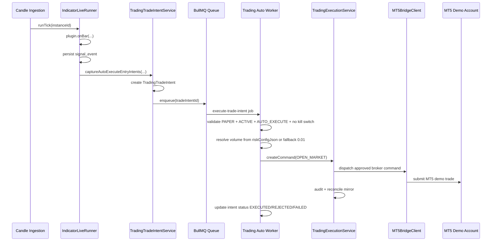

# Trading Worker

Tai lieu nay mo ta luong `paper auto-execution worker` cho Trading.
Story lien quan:
- `4.16-add-paper-auto-execution-worker-for-live-signal-intents`
- `4.17-harden-auto-execution-worker-for-scalable-multi-user-trading` (implemented)

## Muc tieu

Worker nay tach rieng phan `signal evaluation` khoi `broker side effects`.

He thong khong ban lenh MT5 truc tiep trong `IndicatorLiveRunner`.
Thay vao do:

1. Live runner luu `signal_event`
2. Tao `TradingTradeIntent`
3. Enqueue job vao queue
4. Worker consume job
5. Worker goi `TradingExecutionService`
6. `TradingExecutionService` moi la write boundary cuoi cung toi MT5 bridge

## Scope hien tai

- Chi cho `PAPER` account
- Chi support live `ENTRY` event
- Chi map sang `OPEN_MARKET`
- Chua auto xu ly `ENTRY_CONFIRMED`
- Chua auto xu ly `MOVE_SL_BE`, `TRAIL_*`, `TP1_HIT`, `STOP_HIT`, `EXPIRATION`

Neu gap account `LIVE` hoac binding khong hop le, worker se `fail-closed`.

## So do tong quan

```text
New Candle
   |
   v
IndicatorLiveRunner
   |
   |-- plugin.onBar()
   |-- persist signal_event
   |-- capture auto-execute intents
   v
TradingTradeIntent
   |
   |-- enqueue BullMQ job
   v
Queue: trading:auto-execution
   |
   v
Trading Auto Worker
   |
   |-- validate account/binding/intent
   |-- resolve paper volume
   |-- call TradingExecutionService.createCommand()
   v
TradingExecutionCommand
   |
   |-- MT5BridgeClient
   |-- mirror reconcile
   v
MT5 Demo Account
```

## Sequence diagram



## Logic chi tiet

### 1. Live runner

File:
- `src/services/signals/IndicatorLiveRunner.ts`

Khi indicator live phat event:

- Luu `signal_event`
- Neu event la `ENTRY` va co `step.signal`
  - goi `TradingTradeIntentService.captureAutoExecuteEntryIntents(...)`
- Neu capture intent loi
  - runner chi log debug
  - khong fail tick

Muc dich: khong de worker hay broker lam block runtime signal.

### 2. Trade intent capture

File:
- `src/services/trading/TradingTradeIntentService.ts`

Service nay chi tao intent neu thoa tat ca:

- `indicatorInstanceId` dung voi binding
- `binding.mode = AUTO_EXECUTE`
- `binding.status = ACTIVE`
- `binding.killSwitchActive = false`
- `account.accountMode = PAPER`
- live event la `ENTRY`

Moi intent duoc persist vao bang:

- `trading_trade_intents`

Quan he chinh:

- `accountId`
- `bindingId`
- `indicatorInstanceId`
- `signalEventId`
- optional `tradeIntentId -> trading_execution_commands`

Unique key:

- `(bindingId, signalEventId)`

Muc dich: cung 1 binding va 1 signal event khong tao duplicate intent.

### 3. Queue

File:
- `src/queues/tradingAutoExecutionQueue.ts`

Queue name:

- `trading:auto-execution`

Job payload:

```ts
{
  tradeIntentId: string
}
```

### 4. Worker

Files:
- `src/workers/tradingAutoExecutionWorker.ts`
- `src/services/trading/TradingAutoExecutionProcessor.ts`

Worker process:

1. Claim intent tu `QUEUED` sang `PROCESSING`
2. Load intent + binding + account
3. Validate
4. Resolve volume
5. Goi `TradingExecutionService.createCommand(...)`
6. Cap nhat intent status

## Dieu kien fail-closed

Worker se `REJECTED` va khong ban lenh neu:

- account khong phai `PAPER`
- binding khong con `AUTO_EXECUTE`
- binding khong con `ACTIVE`
- `killSwitchActive = true`
- intent khong phai `OPEN_MARKET`
- intent khong co `side`

Worker se `FAILED` neu:

- enqueue loi
- command boundary nem exception
- MT5 bridge dispatch/reconcile loi

## Resolve volume

Worker resolve khoi luong theo thu tu:

1. `riskConfigJson.fixedVolume`
2. `riskConfigJson.volume`
3. `riskConfigJson.lotSize`
4. fallback `0.01`

Fallback `0.01` duoc dung de test toc do paper trade ngay ca khi binding chua co risk profile day du.

## Trang thai intent

Enum:

- `QUEUED`
- `PROCESSING`
- `EXECUTED`
- `REJECTED`
- `FAILED`

Y nghia:

- `QUEUED`: da tao intent va da dua vao queue
- `PROCESSING`: worker da claim job
- `EXECUTED`: command da di qua boundary va hoan tat/reconciled
- `REJECTED`: bi chan theo guardrail hoac precondition
- `FAILED`: loi runtime hoac dispatch

## Vi sao khong goi MT5 truc tiep tu live runner

Neu runner goi broker truc tiep:

- tick signal bi block boi bridge/network
- kho retry va idempotency
- kho audit
- tron `signal logic` voi `execution side effect`

Trade intent + worker giai quyet cac diem do:

- co queue
- co audit
- co idempotency key
- co trang thai trung gian
- fail-closed ro rang

## Write boundary

Worker khong bypass boundary trading.

Worker van goi:

- `TradingExecutionService.createCommand(...)`

Nen van giu duoc:

- command audit
- validation
- broker preconditions
- MT5 bridge dispatch
- mirror reconcile

## API va UI lien quan

Route moi:

- `GET /api/trading/accounts/:id/automation/intents`

UI:

- Trading tab `Automation`
- hien recent worker intents
- cho inspect:
  - binding
  - symbol
  - side
  - volume
  - entry/sl/tp
  - linked command status
  - reason khi reject/fail

File:
- `web/src/components/trading/TradingWorkspace.tsx`

## Bang DB lien quan

- `trading_trade_intents`
- `trading_execution_commands`
- `trading_execution_events`
- `trading_automation_bindings`
- `signal_events`

Migration:

- `prisma/migrations/20260312233000_add_trading_trade_intents_for_auto_execution_worker/migration.sql`

## Cach chay

Mo 3 terminal rieng:

Backend API:

```powershell
npm run dev
```

Trading worker:

```powershell
npm run dev:trading:auto-worker
```

Reconciliation worker:

```powershell
npm run dev:trading:reconciliation-worker
```

Frontend:

```powershell
npm --prefix web run dev
```

## File map

- `src/services/signals/IndicatorLiveRunner.ts`
- `src/services/trading/TradingTradeIntentService.ts`
- `src/queues/tradingAutoExecutionQueue.ts`
- `src/workers/tradingAutoExecutionWorker.ts`
- `src/services/trading/TradingAutoExecutionProcessor.ts`
- `src/services/trading/TradingExecutionService.ts`
- `src/routes/registerTradingWorkspaceRoutes.ts`
- `web/src/components/trading/TradingWorkspace.tsx`

## Gioi han hien tai

- Chua co full autonomous lifecycle cho close/modify/partial close
- Chua map `ENTRY_CONFIRMED` thanh command rieng
- Chua co risk engine day du cho moi plugin live
- Chua co dead-letter flow rieng cho retry strategy

## Huong mo rong tiep theo

Neu muon mo rong phase sau, huong dung la:

1. Chuan hoa live command contract cho `ENTRY_CONFIRMED` va exit-management events
2. Them intent types cho `MODIFY_POSITION`, `PARTIAL_CLOSE`, `CLOSE_POSITION`
3. Them retry policy va dead-letter queue
4. Them risk profile domain ro rang hon thay vi fallback `0.01`

---

## Scaling Configuration (1000 users)

### Worker Concurrency

BullMQ worker su dung `concurrency` de xu ly nhieu jobs dong thoi.

Env var:

- `WORKER_CONCURRENCY` — so jobs xu ly dong thoi (default: `10`, khuyen nghi: `10`–`50`)
- `TRADING_RECONCILIATION_DELAY_MS` — do tre truoc khi job reconcile duoc enqueue (default: `5000`)
- `TRADING_RECONCILIATION_WORKER_CONCURRENCY` — so sync jobs reconcile dong thoi (default: `3`)

Worker doc gia tri tu env khi khoi tao:

```ts
// src/queues/tradingAutoExecutionQueue.ts
concurrency: Number(env.WORKER_CONCURRENCY ?? '10')
```

### Database Connection Pool

Prisma connection pool can phu hop voi concurrency:

```
DATABASE_URL="postgresql://...?connection_limit=20&pool_timeout=30"
```

Quy tac: `connection_limit >= WORKER_CONCURRENCY * 2` de du cho cac query song song trong moi job.

### Redis

Hien tai dung 1 Redis cho tat ca (queue, pub/sub, alerts). Khi scale:

- Tach Redis instance cho BullMQ queue rieng
- Hoac cau hinh `maxmemory-policy allkeys-lru`

---

## Safety Guards

### Intent TTL (Time-To-Live)

Intent nam trong queue qua lau se bi reject thay vi execute voi gia cu:

```ts
const MAX_INTENT_AGE_MS = 30_000; // 30 giay
const intentAge = Date.now() - intent.createdAt.getTime();
if (intentAge > MAX_INTENT_AGE_MS) {
    rejectIntent(tradeIntentId, `Intent expired: ${Math.round(intentAge / 1000)}s old.`);
    return;
}
```

### Price Deviation Check

So sanh gia entry trong signal voi quote hien tai tu MT5 bridge truoc khi submit:

```ts
const MAX_PRICE_DEVIATION_PERCENT = 0.5;
const quote = await mt5BridgeClient.fetchQuote(account.credential, intent.symbol);
const currentPrice = intent.side === 'SHORT'
    ? quote.bid ?? quote.last ?? quote.ask
    : quote.ask ?? quote.last ?? quote.bid;
const signalPrice = Number(intent.entryPrice);
const deviation = Math.abs(currentPrice - signalPrice) / signalPrice * 100;
if (deviation > MAX_PRICE_DEVIATION_PERCENT) {
    rejectIntent(tradeIntentId, `Price moved ${deviation.toFixed(2)}% from signal.`);
    return;
}
```

### Kill Switch

Binding da co `killSwitchActive` flag. Worker check truoc khi execute. Admin co the bat kill switch de dung toan bo auto-execution cho 1 binding.

---

## Failure Scenarios

### Category 1: Latency & Timing

| ID | Scenario | Severity | Hau qua |
|----|----------|----------|---------|
| F1 | Queue delay (concurrency=1) | CRITICAL | User entry gia xau, thua lo |
| F2 | Price deviation (gia troi xa signal) | CRITICAL | Risk/reward bi pha huy |
| F3 | Signal burst (nhieu signal cung luc) | HIGH | Queue flooding, DB overload |

### Category 2: Resource Exhaustion

| ID | Scenario | Severity | Hau qua |
|----|----------|----------|---------|
| F4 | DB connection pool het | CRITICAL | Tat ca intents fail |
| F5 | Redis memory spike | HIGH | Queue + pub/sub + alerts stop |
| F6 | MT5 bridge overwhelm | CRITICAL | Tat ca trades fail BRIDGE_UNREACHABLE |
| F7 | Prisma timeout (heavy transaction) | HIGH | Signal events bi delay |

### Category 3: Data Integrity

| ID | Scenario | Severity | Hau qua |
|----|----------|----------|---------|
| F8 | Double execution | OK (da handle) | Atomic claim + idempotency key bao ve |
| F9 | Orphaned intents (QUEUED mai mai) | HIGH | Intent bi treo, user khong biet |
| F10 | Stale mirror data | MEDIUM | Position count sai |

### Category 4: Infrastructure

| ID | Scenario | Severity | Hau qua |
|----|----------|----------|---------|
| F11 | Worker crash, job lost | HIGH | Intent bi treo |
| F12 | Credential cross-leak | OK (da safe) | Account isolation dung |

### Uoc tinh throughput

| Metric | Hien tai | Muc tieu 1000 users |
|--------|----------|---------------------|
| Worker concurrency | 1 | 10–50 |
| Intents/giay peak | ~5 | ~500 |
| Bridge calls/intent | 5 (1 trade + 4 sync) | 1 (defer sync) |
| DB writes/intent | ~8 | 3–4 (batch) |
| Queue throughput | ~5 jobs/s | ~200 jobs/s |

---

## Retry & Recovery

### BullMQ Retry

```ts
{
    attempts: 3,
    backoff: {
        type: 'exponential',
        delay: 2000, // 2s, 4s, 8s
    },
}
```

Intent `FAILED` da duoc design de re-processable: claim pattern cho phep worker retry tu `FAILED` sang `PROCESSING`.

### Stale Intent Scanner

Can co scheduled job (cron hoac BullMQ repeatable job):

- Scan intents `QUEUED` > 5 phut → re-enqueue hoac mark `FAILED`
- Scan intents `PROCESSING` > 2 phut → mark `FAILED` (worker crash)

### Dead-Letter Queue

Jobs that fail after all retry attempts can be moved to a DLQ for manual inspection.

---

## Monitoring & Alerting

### Key Metrics

| Metric | Alert Threshold |
|--------|----------------|
| Queue depth (waiting jobs) | > 100 |
| Queue latency (oldest job age) | > 30s |
| Intent processing time (p95) | > 5s |
| Bridge error rate | > 10% trong 1 phut |
| DB connection pool usage | > 80% |
| Redis memory usage | > 80% max |
| Worker crash count | > 0 trong 5 phut |

### Health Check Endpoint

Worker nen expose health endpoint (hoac BullMQ Board):

- Queue depth, active jobs, failed jobs
- Bridge health status
- DB connection pool status

---

## Horizontal Scaling Strategy

### Cac strategy da phan tich

| Strategy | Mo ta | Workers @ 1000 users | DB Connections | RAM |
|----------|-------|---------------------|----------------|-----|
| A: Shared Queue | 1 queue, N workers (de xuat ban dau) | 3 | 60 | 300MB |
| B: User-Sharded | 2 users/worker rieng | 500 | 10,000 | 50GB |
| C: Symbol-Sharded | 1 queue/symbol | 10 | 200 | 1GB |
| **D: Auto-Scaled** | **1 queue, auto-scale workers** | **2→10** | **40→200** | **200MB→1GB** |

### Vi sao KHONG nen dung Strategy B (2 users/worker)

1. 500 workers × 20 DB connections = 10,000 connections (PostgreSQL default max = 100)
2. 500 PrismaClient instances = 50GB RAM
3. 87% worker idle time (lang phi)
4. Can meta-service de orchestrate workers
5. Bridge van la bottleneck chung — khong giai quyet duoc

### Strategy D: Auto-Scaled Shared Queue (khuyen nghi)

BullMQ tu dong distribute jobs giua nhieu worker instances.

Auto-scale dua tren queue depth:

```ts
const waiting = await queue.getWaitingCount();
const active = await queue.getActiveCount();
const targetWorkers = Math.min(
    Math.max(Math.ceil((waiting + active) / 50), 1),
    MAX_WORKERS,
);
```

Scale states:

| State | Workers | Throughput |
|-------|---------|-----------|
| Idle (dem) | 2 | 20 jobs/s |
| Normal | 3 | 30 jobs/s |
| Peak (news) | 8 | 80 jobs/s |
| Burst | 10 | 100 jobs/s |

### User Fairness

De 1 user khong monopolize queue:

1. Priority queue:

```ts
const userPendingCount = await getUserPendingIntentCount(userId);
const priority = Math.min(userPendingCount, 10);
await queue.add(jobName, payload, { priority });
```

2. Per-user rate limit:

```ts
const MAX_INTENTS_PER_USER_PER_MINUTE = 20;
```

### Chay nhieu workers

```powershell
# Instance 1
$env:WORKER_CONCURRENCY="10"; npm run dev:trading:auto-worker
$env:TRADING_RECONCILIATION_WORKER_CONCURRENCY="3"; npm run dev:trading:reconciliation-worker

# Instance 2
$env:WORKER_CONCURRENCY="10"; npm run dev:trading:auto-worker
```

Production (Docker):

```yaml
services:
  trading-worker:
    command: npm run start:trading:auto-worker
    environment:
      - WORKER_CONCURRENCY=20
    deploy:
      replicas: 3
  trading-reconciliation-worker:
    command: npm run start:trading:reconciliation-worker
    environment:
      - TRADING_RECONCILIATION_DELAY_MS=5000
      - TRADING_RECONCILIATION_WORKER_CONCURRENCY=3
```

Tong throughput = `replicas * WORKER_CONCURRENCY` concurrent jobs.

---

## Reconciliation Strategy

### Van de hien tai

Sau moi command, `TradingExecutionService.createCommand()` khong con goi `forceSync()` inline khi worker bat `skipReconciliation`. Thay vao do command se enqueue delayed reconciliation job. Moi `forceSync()` = 4 bridge calls (summary, positions, orders, deals) + nhieu DB writes. Voi 1000 users, day la bottleneck lon nhat.

### Giai phap: Deferred Reconciliation

1. Worker chi goi trade command (1 bridge call)
2. Sau khi trade thanh cong, enqueue 1 delayed reconciliation job vao queue rieng
3. Reconciliation worker xu ly sync theo batch (1 sync/account, debounced)

```text
Queue: trading:auto-execution       → Trade worker (nhanh, chi 1 bridge call)
Queue: trading:reconciliation        → Reconciliation worker (chay rieng, debounced)
```

### Rate Limiter cho Bridge

BullMQ ho tro built-in rate limiter:

```ts
limiter: {
    max: 50,        // max 50 bridge calls
    duration: 1000, // per second
}
```

### Priority Queue

Khi ho tro LIVE accounts:

```ts
await queue.add(jobName, payload, {
    priority: account.accountMode === 'LIVE' ? 1 : 5,
});
```

LIVE accounts luon duoc xu ly truoc PAPER accounts.
